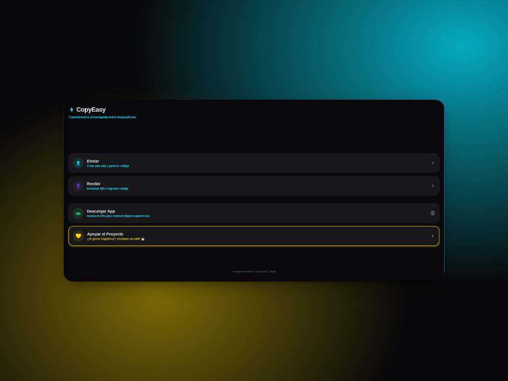

# 🌐 Portafolio Web Profesional — Francisco Arias


---

## 📖 1. Descripción

Portafolio web personal e interactivo de **Francisco Arias**, estudiante de la carrera de **Ingeniería en Software** en la **Universidad Estatal de Milagro (UNEMI)**.

El proyecto fue diseñado y programado desde cero con el propósito de comunicar de manera clara, accesible y profesional la identidad técnica del desarrollador, sus competencias prácticas y sus proyectos de software más destacados.

### Secciones principales del sitio:
* **Inicio / Hero (`#hero`)**: Presentación profesional, indicador de disponibilidad y llamada a la acción.
* **Sobre Mí (`#about`)**: Formación en Ingeniería en Software, enfoque vocacional y estadísticas académicas.
* **Habilidades Técnicas (`#skills`)**: Competencias clasificadas en Frontend, Backend & Bases de Datos y Herramientas con barras de nivel accesibles.
* **Proyectos Destacados (`#projects`)**: Galería con filtrado interactivo por categorías (Mobile, Web & Full Stack) y ventana modal con especificaciones técnicas detalladas.
* **Design System (`#design-system`)**: Documentación interactiva de tokens de diseño (paleta bicolor Rojo Neón y Verde Matrix con copiado HEX al portapapeles, jerarquía tipográfica, escala de espaciados y componentes reutilizables).
* **Contacto (`#contact`)**: Formulario con validación en tiempo real, contador dinámico de caracteres y envío con notificación Toast.

---

## 🛠️ 2. Tecnologías Utilizadas

Desarrollado exclusivamente con tecnologías web nativas, sin frameworks externos ni librerías pesadas:

* **HTML5 Semántico**: Maquetación estructurada con elementos semánticos (`<header>`, `<nav>`, `<main>`, `<section>`, `<article>`, `<aside>`, `<footer>`, `<figure>`, `<dialog>`, `<form>`) que garantizan accesibilidad (a11y) y optimización SEO.
* **CSS3 Moderno & Custom Properties**:
  - Arquitectura modular separada en archivos independientes (`variables.css`, `base.css`, `components.css`, `sections.css`, `responsive.css`).
  - Tokens de diseño para variables de color (paleta principal Rojo Neón `#ff1e42` y Verde Matrix `#00ff41`), tipografía fluida con `clamp()`, espaciados y sombras.
  - Diseño 100% responsivo adaptable a computadoras de escritorio, tablets y dispositivos móviles mediante CSS Grid, Flexbox y Media Queries.
* **Vanilla JavaScript (ES6+)**:
  - Arquitectura modular basada en ES Modules (`import` / `export`).
  - Alternancia y persistencia del modo claro/oscuro en `localStorage` con detección de preferencias del sistema operativo.
  - Navegación móvil tipo hamburguesa accesible con gestión de atributos ARIA y cierre con tecla `Escape`.
  - ScrollSpy con detección de sección activa en tiempo real y botón flotante de desplazamiento hacia arriba.
  - Filtro dinámico de proyectos y ventana modal accesible con Focus Trap.
  - Validación instantánea de campos de formulario con expresiones regulares y confirmación Toast.
  - API del Portapapeles (`navigator.clipboard`) para el copiado interactivo de tokens de diseño.

---

## 🚀 3. Instrucciones de Visualización

### Opción A: Visualización en Producción (GitHub Pages)

El sitio se encuentra publicado y accesible públicamente en el siguiente enlace:

🔗 **Demo en vivo**: [https://franciscoarias10.github.io/S2-Tarea-1-Desarollo-web/](https://franciscoarias10.github.io/S2-Tarea-1-Desarollo-web/)

> **Nota para visualización limpia**: Para evitar que el navegador muestre archivos previamente guardados en la memoria caché, se recomienda abrir el enlace en una ventana de incógnito o presionar `Ctrl + Shift + R` (`Cmd + Shift + R` en Mac).

### Opción B: Ejecución en Entorno Local

1. **Clonar el repositorio**:
   ```bash
   git clone https://github.com/FranciscoArias10/S2-Tarea-1-Desarollo-web.git
   cd S2-Tarea-1-Desarollo-web
   ```

2. **Abrir el proyecto**:
   - **Método directo**: Abrir el archivo `index.html` en cualquier navegador web moderno (Google Chrome, Mozilla Firefox, Microsoft Edge, Safari).
   - **Con un servidor local (recomendado para soporte nativo de ES Modules)**:
     - Con **Live Server** (Extensión de VS Code): Clic derecho en `index.html` → *Open with Live Server*.
     - Con **Python**:
       ```bash
       python3 -m http.server 8000
       ```
       Luego ingresar a `http://localhost:8000` en el navegador.
     - Con **Node.js**:
       ```bash
       npx serve .
       ```

---

## 📸 4. Capturas del Resultado

A continuación se presentan las capturas reales de los proyectos desarrollados e integrados en el portafolio:

### 1. LibrePDF — Conversor & Escáner Móvil a PDF
> Alternativa libre, rápida y gratuita a CamScanner desarrollada con React Native, TypeScript y Expo SDK para digitalizar fotos a PDF con filtros de realce y reordenamiento de páginas.


* **Tecnologías**: React Native, TypeScript, Expo SDK 57, Image Manipulator, Print & FileSystem.
* **Repositorio**: [GitHub - LibrePDF](https://github.com/FranciscoArias10/LibrePDF)

---

### 2. LibreFree — Lector de Libros & Audiolibros
> Lector móvil moderno para formatos EPUB y PDF con síntesis de voz en tiempo real (Text-to-Speech), almacenamiento seguro con SQLite y modo OLED.


* **Tecnologías**: React Native, TypeScript, Expo Speech & Audio, SQLite WAL, ePub.js.
* **Repositorio**: [GitHub - LibreFree](https://github.com/FranciscoArias10/librefree-React)

---

### 3. SES-Platform — Portal de Gestión Educativa
> Plataforma web en producción para analítica académica institucional, métricas de rendimiento y control de asistencia.


* **Tecnologías**: React, TypeScript, CSS Custom Properties, REST APIs, Vercel.
* **Repositorio**: [GitHub - SES-Platform](https://github.com/FranciscoArias10/SES-Platform)
* **Demo en Vivo**: [ses-platform-ten.vercel.app](https://ses-platform-ten.vercel.app/)

---

### 4. acuaIA — Inteligencia Artificial Acuícola
> Plataforma web inteligente orientada a la acuicultura para análisis de telemetría y predicción de biomasa mediante Machine Learning.


* **Tecnologías**: Python, JavaScript, CSS3, Chart.js, Vercel.
* **Repositorio**: [GitHub - acuaIA](https://github.com/FranciscoArias10/acuaIA)
* **Demo en Vivo**: [aquascan-ai.vercel.app](https://aquascan-ai.vercel.app/)

---

### 5. SearchPineapple — Comparador de Precios Tecnológicos
> Aplicación web responsiva para búsqueda, catálogo y comparación interactiva de precios de productos tecnológicos.


* **Tecnologías**: HTML5, CSS3, JavaScript, Responsive Design, Netlify.
* **Repositorio**: [GitHub - SearchPineapple](https://github.com/FranciscoArias10/SearchPineapple)
* **Demo en Vivo**: [mellow-treacle-e9c680.netlify.app](https://6508ea205d971a6e18e26809--mellow-treacle-e9c680.netlify.app/)

---

### 6. CopyEasy — Transferencia de Archivos Multiplataforma
> Solución web ligera y multiplataforma para compartir texto, archivos y enlaces rápidamente en red local.



* **Tecnologías**: HTML5, CSS3, JavaScript ES6+, Netlify.
* **Repositorio**: [GitHub - CopyEasy](https://github.com/FranciscoArias10/CopyEasy-)
* **Demo en Vivo**: [copyeasy.netlify.app](https://copyeasy.netlify.app/)

---

## 👤 Autor & Contacto

* **Estudiante**: Francisco Arias
* **Carrera**: Ingeniería en Software — UNEMI (Universidad Estatal de Milagro)
* **GitHub**: [@FranciscoArias10](https://github.com/FranciscoArias10)
* **LinkedIn**: [Francisco Steven Arias Pérez](https://www.linkedin.com/in/francisco-steven-arias-p%C3%A9rez-5b8663219/)
