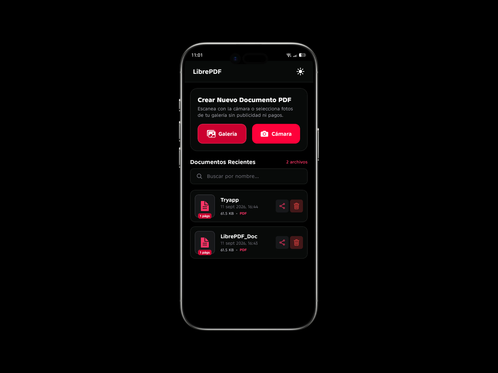
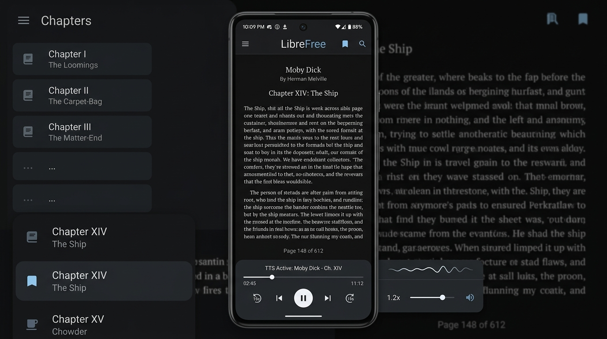
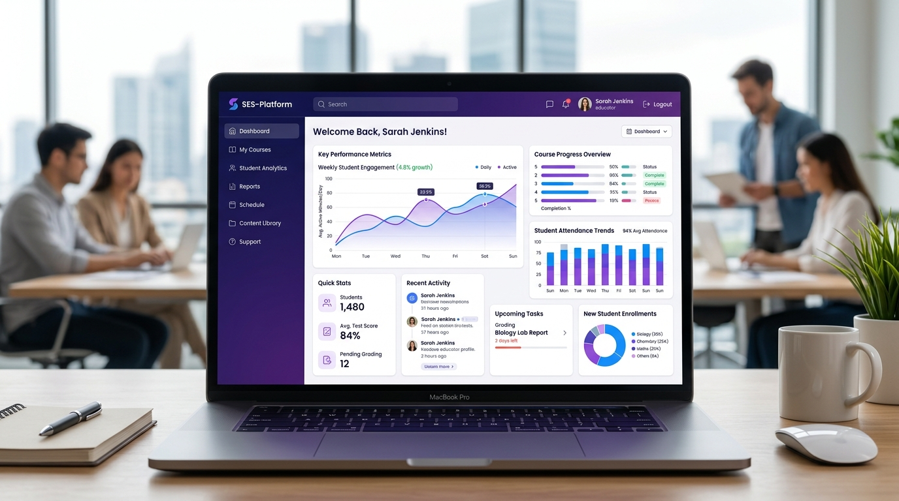
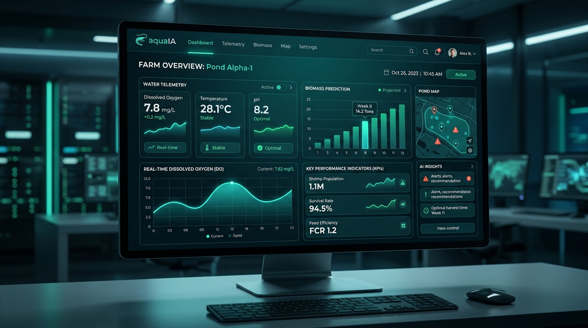
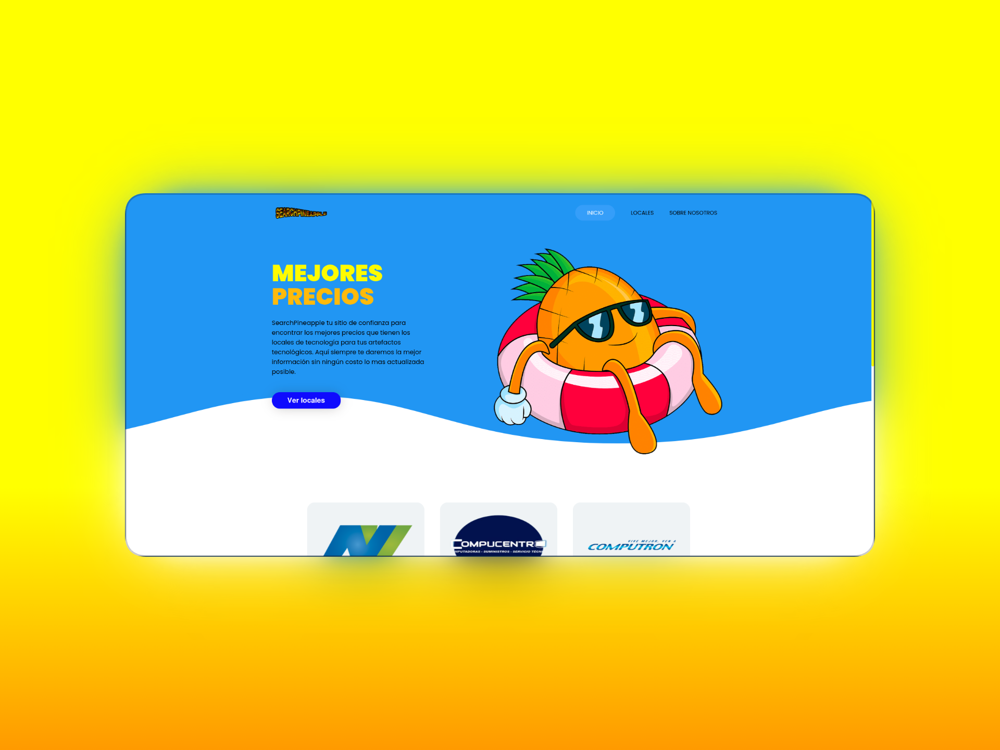

# 🌐 Portafolio Web Profesional e Interactivo — Francisco Arias


Portafolio web personal e interactivo de **Francisco Steven Arias Pérez**, estudiante de la carrera de **Ingeniería en Software** en la **Universidad Estatal de Milagro (UNEMI)**. Desarrollado desde cero aplicando estrictos estándares de **HTML5 semántico**, arquitectura CSS modular basada en **Custom Properties (Design Tokens)** e interactividad avanzada mediante **Vanilla JavaScript (ES6+)**, sin frameworks externos ni librerías pesadas.

---

## 📌 Tabla de Contenidos
1. [Descripción del Proyecto](#-1-descripción-del-proyecto)
2. [Tecnologías Utilizadas](#-2-tecnologías-utilizadas)
3. [Capturas del Resultado & Proyectos](#-3-capturas-del-resultado--proyectos)
4. [Instrucciones de Visualización](#-4-instrucciones-de-visualización)
5. [Estructura del Repositorio](#-5-estructura-del-repositorio)
6. [Arquitectura CSS & Design System](#-6-arquitectura-css--design-system)
7. [Interactividad JavaScript Implementada](#-7-interactividad-javascript-implementada)
8. [Matriz de Cumplimiento de la Rúbrica](#-8-matriz-de-cumplimiento-de-la-rúbrica)
9. [Control de Versiones & Commits](#-9-control-de-versiones--commits)
10. [Créditos & Contacto](#-10-créditos--contacto)

---

## 📖 1. Descripción del Proyecto

El objetivo central de este proyecto es comunicar de manera clara, estructurada y atractiva la identidad profesional y académica del estudiante, sus proyectos de software más destacados y las competencias técnicas que domina de forma verificable.

### Objetivos y Enfoque de Desarrollo:
* **Comunicación Profesional Efectiva**: Presentación transparente de formación académica, trayectoria vocacional, habilidades y canales oficiales de contacto.
* **Separación de Responsabilidades**: Estricta división entre **Estructura** (`index.html`), **Presentación** (`css/`) y **Comportamiento** (`js/`).
* **HTML5 Semántico Estricto**: Maquetación construida mediante etiquetas semánticas (`header`, `nav`, `main`, `section`, `article`, `aside`, `footer`, `figure`, `figcaption`, `dialog`, `form`), evitando el uso abusivo de elementos `<div>`.
* **Accesibilidad & SEO**: Jerarquía lógica de encabezados (`h1` a `h4` con un único `h1`), atributos `alt` descriptivos en imágenes, soporte para lectores de pantalla con atributos ARIA (`role="progressbar"`, `role="dialog"`, `role="alert"`) y navegación asistida por teclado (*Focus Trap* y tecla `Escape`).
* **Diseño Responsivo Fluido**: Adaptabilidad ergonómica a computadoras de escritorio, tablets y teléfonos móviles sin desbordamiento horizontal (`overflow-x: hidden`).

### Estructura de las 6 Secciones Obligatorias:
1. **Inicio / Presentación (`#hero`)**:
   - Saludo interactivo con badge de disponibilidad para pasantías y proyectos de desarrollo.
   - Encabezado `<h1>` principal con gradiente de texto moderno.
   - Fotografía profesional con animación orgánica (Blob morphing) y badges flotantes.
   - Botones de acción directa (*Call To Action*) y chips de tecnologías principales.
2. **Sobre Mí (`#about`)**:
   - `<article>` con la historia vocacional, formación en Ingeniería en Software en la **UNEMI** y filosofía de desarrollo centrado en código limpio.
   - `<aside>` complementario con tarjetas de estadísticas: Carrera Universitaria, +4 Proyectos Desarrollados, +500 Horas de Programación y Metodologías Ágiles (Scrum & Gitflow).
3. **Habilidades Técnicas — Skills (`#skills`)**:
   - Organizadas en 3 categorías claras: **Frontend**, **Backend & Bases de Datos** y **Herramientas & Entorno de Trabajo**.
   - Cada habilidad incluye ícono vectorial SVG, nivel de dominio porcentual y cualitativo justificable, descripción técnica y barra de progreso accesible con atributos ARIA.
4. **Proyectos Destacados (`#projects`)**:
   - Sistema de filtrado interactivo por categorías (*Todos*, *Mobile Apps*, *Full Stack & Web*).
   - Componentes reutilizables tipo Card (`<article class="project-card">`) para cada proyecto con: nombre, descripción, problema que resuelve, tags de tecnologías, imagen, enlace a repositorio y enlace a demo desplegado.
5. **Design System / Componentes (`#design-system`)**:
   - Documentación viva de las decisiones visuales del proyecto:
     - Muestrario de paleta de colores con copiado interactivo de código HEX al hacer clic.
     - Jerarquía tipográfica en vivo (`h1`, `h2`, `h3`, párrafos, textos muted, enlaces, etiquetas `<code>`).
     - Escala gráfica de espaciados documentada en píxeles (`--space-2xs` a `--space-3xl`).
     - Galería de componentes reutilizables reales (botones, badges, inputs con foco y validación, card base).
6. **Contacto (`#contact`)**:
   - Datos profesionales verificados (Correo institucional UNEMI, GitHub, LinkedIn y Ubicación geográfica).
   - Formulario accesible con validación en tiempo real de campos, regex de correo, contador dinámico de caracteres (`0 / 500`) y notificación Toast de éxito.

---

## 🛠️ 2. Tecnologías Utilizadas

El proyecto fue desarrollado exclusivamente con tecnologías web estándares sin recurrir a frameworks prefabricados:

| Tecnología | Rol en el Proyecto | Justificación Técnica |
|---|---|---|
| **HTML5 Semántico** | Estructura & Contenido | Empleo de elementos semánticos estándar para máxima accesibilidad, jerarquía de encabezados estricta y SEO optimizado. |
| **CSS3 Nativo** | Presentación & Estilos | Arquitectura modular propia, Flexbox, CSS Grid, tipografía fluida con `clamp()` y variables nativas (**CSS Custom Properties**). Sin Bootstrap ni Tailwind. |
| **Vanilla JavaScript (ES6+)** | Lógica & Comportamiento | Programación modular con ES Modules (`type="module"`), manipulación eficiente del DOM, eventos nativos y persistencia en `localStorage`. |
| **Git & GitHub** | Control de Versiones | Registro progresivo del desarrollo mediante commits atómicos y descriptivos basados en el estándar **Conventional Commits**. |
| **GitHub Pages** | Alojamiento & Despliegue | Publicación web en producción con enlaces relativos para garantizar compatibilidad multiplataforma. |
| **Google Fonts** | Tipografía | Fuentes modernas de alta legibilidad: *Outfit* (encabezados/UI), *Inter* (cuerpo de texto) y *JetBrains Mono* (código). |

---

## 📸 3. Capturas del Resultado & Proyectos

A continuación se presentan las capturas reales de los proyectos desarrollados por el estudiante y los recursos visuales integrados en el portafolio:

### 1. LibrePDF — Conversor & Escáner Móvil a PDF
> Alternativa libre, rápida y gratuita a CamScanner desarrollada con React Native, TypeScript y Expo SDK 57 para digitalizar fotos a PDF con filtros de realce y reordenamiento de páginas.



* **Problema que resuelve**: Elimina la dependencia de aplicaciones comerciales invasivas que imponen marcas de agua, anuncios y suscripciones de pago.
* **Tecnologías**: React Native, TypeScript, Expo SDK 57, Image Manipulator, Print & FileSystem.
* **Repositorio**: [GitHub - LibrePDF](https://github.com/FranciscoArias10/LibrePDF)
* **Categoría**: Mobile Application

---

### 2. LibreFree — Lector de Libros & Audiolibros
> Lector móvil moderno para formatos EPUB y PDF con síntesis de voz en tiempo real (Text-to-Speech), almacenamiento local seguro SQLite y modo oscuro OLED.



* **Problema que resuelve**: Falta de lectores de libros sin costo con función de audiolibro offline que protejan la privacidad del usuario sin requerir inicio de sesión.
* **Tecnologías**: React Native, TypeScript, Expo Speech & Audio, SQLite WAL, ePub.js.
* **Repositorio**: [GitHub - LibreFree](https://github.com/FranciscoArias10/librefree-React)
* **Categoría**: Mobile & Audio Application

---

### 3. SES-Platform — Portal de Gestión Educativa
> Plataforma web en producción orientada a instituciones académicas que centraliza métricas de rendimiento estudiantil, reportes de asistencia y control de asignaturas.



* **Problema que resuelve**: Descentralización y fragmentación de información académica entre docentes, administradores y estudiantes.
* **Tecnologías**: TypeScript, React, CSS Custom Properties, REST APIs, Vercel.
* **Repositorio**: [GitHub - SES-Platform](https://github.com/FranciscoArias10/SES-Platform)
* **Demo en Vivo**: [ses-platform-two.vercel.app](https://ses-platform-two.vercel.app)
* **Categoría**: Full Stack Web

---

### 4. acuaIA — Inteligencia Artificial Acuícola
> Plataforma web inteligente para el sector camaronero y acuícola que procesa telemetría de piscinas (oxígeno disuelto, pH, temperatura) y predice biomasa mediante modelos de IA.



* **Problema que resuelve**: Monitoreo manual ineficiente de la calidad del agua y predicción tardía de biomasa que incrementa la mortalidad en cultivos.
* **Tecnologías**: JavaScript, Machine Learning, Data Visualization, CSS Custom Properties, Vercel.
* **Repositorio**: [GitHub - acuaIA](https://github.com/FranciscoArias10/acuaIA)
* **Demo en Vivo**: [acua-ia.vercel.app](https://acua-ia.vercel.app)
* **Categoría**: AI & Web Platform

---

### 5. SearchPineapple — Buscador y Comparador de Precios Tech
> Portal web interactivo para encontrar y comparar los mejores precios en locales de tecnología y artefactos electrónicos en Ecuador (CompuCentro, Computron, etc.), con información actualizada sin costo.



* **Problema que resuelve**: Precios dispersos y desactualizados en locales de tecnología física, facilitando la toma de decisiones informadas y económicas.
* **Tecnologías**: HTML5, CSS3, JavaScript, Responsive Design, Netlify.
* **Repositorio**: [GitHub - FranciscoArias10](https://github.com/FranciscoArias10)
* **Demo en Vivo**: [mellow-treacle-e9c680.netlify.app](https://6508ea205d971a6e18e26809--mellow-treacle-e9c680.netlify.app/#adadcard)
* **Categoría**: Web & Comparador

---

## 🖥️ 4. Instrucciones de Visualización

### 4.1 Visualización Pública en GitHub Pages (Recomendado)
El portafolio se encuentra publicado y accesible globalmente en:

🌐 **URL Pública del Portafolio**:  
👉 **[https://franciscoarias10.github.io/S2-Tarea-1-Desarollo-web/](https://franciscoarias10.github.io/S2-Tarea-1-Desarollo-web/)**

📂 **URL del Repositorio en GitHub**:  
👉 **[https://github.com/FranciscoArias10/S2-Tarea-1-Desarollo-web](https://github.com/FranciscoArias10/S2-Tarea-1-Desarollo-web)**

#### Pasos de verificación recomendados antes de la entrega:
1. Abra una ventana en **modo incógnito / privado** en su navegador favorito.
2. Ingrese a la URL pública del portafolio.
3. Compruebe que las hojas de estilo CSS, los scripts JavaScript y las imágenes carguen de forma inmediata.
4. Pruebe la navegación entre todas las secciones utilizando los enlaces del menú y el ScrollSpy.
5. Pruebe las funcionalidades interactivas:
   - Alternancia entre tema **Claro** y **Oscuro** (el tema persiste al recargar la página).
   - Filtrado dinámico de proyectos (*Todos*, *Mobile Apps*, *Full Stack & Web*).
   - Apertura y cierre del **Modal accesible de detalles** con la tecla `Escape` o el botón de cierre.
   - Validación interactiva del formulario de contacto y prueba del contador de caracteres.
   - Copiado interactivo de tokens de color en el Design System.
6. Reduzca el ancho de la ventana o active las *Herramientas de Desarrollador* (`Ctrl + Shift + I` / `F12`) en modo móvil para verificar la versión responsiva y el funcionamiento del menú hamburguesa.
7. Abra la pestaña **Consola** del navegador y confirme que no existen advertencias ni errores de ejecución (`0 errors`).

---

### 4.2 Visualización en Entorno Local

Al emplear arquitectura de módulos nativos de JavaScript (`type="module"`), los navegadores restringen la carga directa bajo el protocolo `file://` por políticas de seguridad CORS. Se debe utilizar un servidor HTTP local:

#### Opción A: Servidor HTTP con Python (Recomendado)
```bash
# 1. Clonar o acceder al directorio del proyecto
cd S2-Tarea#1-Desarollo-web

# 2. Iniciar el servidor local en el puerto 4321 (o el puerto de su preferencia)
python3 -m http.server 4321

# 3. Abrir en su navegador:
# http://localhost:4321
```

#### Opción B: Con la extensión Live Server en Visual Studio Code
1. Abra la carpeta del proyecto en Visual Studio Code.
2. Localice el archivo `index.html` en el explorador de archivos.
3. Haga clic derecho sobre `index.html` y seleccione **"Open with Live Server"**.
4. Su navegador predeterminado se abrirá automáticamente en `http://127.0.0.1:5500`.

---

## 📁 5. Estructura del Repositorio

El código fuente se encuentra organizado de forma modular y desacoplada:

```text
S2-Tarea#1-Desarollo-web/
├── index.html                   # Documento principal con marcado HTML5 semántico
├── .gitignore                   # Archivos y artefactos excluidos del control de versiones
├── README.md                    # Documentación técnica completa, capturas y guía de despliegue
├── css/
│   ├── variables.css            # Design tokens: paleta de color (Dark/Light), tipografía, espaciado
│   ├── base.css                 # Reset moderno, normalización, tipografía base y contenedores
│   ├── components.css           # Botones, cards, badges, modal dialog, toasts y controles de formulario
│   ├── sections.css             # Estilos específicos de cada sección (Hero, About, Skills, DS, Contact)
│   └── responsive.css           # Media queries para Desktop (1024px), Tablet (768px) y Móvil (480px)
├── js/
│   ├── theme.js                 # Controlador del tema Claro / Oscuro con persistencia en localStorage
│   ├── navigation.js            # Menú móvil accesible, ScrollSpy y botón flotante Volver Arriba
│   ├── projects.js              # Filtro dinámico por categoría y modal accesible de proyectos
│   ├── form-validation.js       # Validación de formulario en tiempo real, contador y Toast notifications
│   ├── design-system.js         # Utilidad de copiado ágil de tokens de diseño al portapapeles
│   └── main.js                  # Punto de entrada principal y orquestador de módulos
└── assets/
    └── img/                     # Imágenes optimizadas de proyectos y fotografía de perfil
        ├── profile.jpg          # Foto profesional de Francisco Arias
        ├── project-librepdf.jpg # Captura del proyecto móvil LibrePDF
        ├── project-librefree.jpg# Captura del proyecto móvil LibreFree
        ├── project-sesplatform.jpg # Captura del portal web SES-Platform
        ├── project-acuaia.jpg   # Captura de la plataforma acuaIA
        └── project-searchpineapple.png # Captura del comparador SearchPineapple
```

---

## 🎨 6. Arquitectura CSS & Design System

El diseño visual ha sido construido íntegramente mediante **CSS propio**, sin dependencias de frameworks.

### Decisiones de Diseño con CSS Custom Properties:
Las decisiones visuales se encuentran centralizadas en variables nativas en `:root` (Tema Oscuro por defecto) y redefinidas bajo `[data-theme="light"]`:

```css
:root {
  /* Paleta Primaria & Acentos */
  --color-primary: #ff1e42;
  --color-secondary: #8b5cf6;
  --color-accent: #06b6d4;
  --color-success: #10b981;
  --color-warning: #f59e0b;
  --color-danger: #ef4444;

  /* Superficies y Fondos */
  --color-bg: #090d16;
  --color-surface: #131b2e;
  --color-surface-elevated: #1a243c;
  --color-border: rgba(255, 255, 255, 0.08);

  /* Tipografía */
  --font-primary: 'Outfit', 'Inter', sans-serif;
  --font-mono: 'JetBrains Mono', monospace;

  /* Escala de Espaciados Coherente */
  --space-2xs: 0.25rem;  /* 4px */
  --space-xs: 0.5rem;    /* 8px */
  --space-sm: 0.75rem;   /* 12px */
  --space-md: 1rem;      /* 16px */
  --space-lg: 1.5rem;    /* 24px */
  --space-xl: 2rem;      /* 32px */
  --space-2xl: 3rem;     /* 48px */
  --space-3xl: 4rem;     /* 64px */

  /* Radio de Bordes */
  --radius-sm: 0.5rem;   /* 8px */
  --radius-md: 0.75rem;  /* 12px */
  --radius-lg: 1rem;     /* 16px */
  --radius-full: 9999px;
}
```

* **Tipografía Fluida**: Implementación de funciones matemáticas nativas `clamp()` para tamaños de texto fluidos que escalan sin saltos bruscos entre resoluciones.
* **Layouts**: Uso estricto de Flexbox para alineaciones unidimensionales y CSS Grid para estructuras bidimensionales complejas.

---

## ⚡ 7. Interactividad JavaScript Implementada

Se implementaron más de 7 funcionalidades interactivas reales mediante Vanilla JS:

1. **Modo Claro / Oscuro Dual**:
   - Alternancia instantánea con botón accesible.
   - Persistencia automática de la preferencia del usuario en `localStorage`.
   - Detección reactiva de la preferencia del sistema operativo mediante `matchMedia('(prefers-color-scheme: light)')`.
2. **Navegación Móvil Responsiva**:
   - Menú tipo hamburguesa con control de accesibilidad `aria-expanded` y `aria-controls`.
   - Cierre automático al seleccionar un enlace, hacer clic en el exterior o pulsar la tecla `Escape`.
3. **ScrollSpy & Botón Flotante "Volver Arriba"**:
   - Detección de la sección activa al hacer scroll e iluminación del enlace correspondiente en la cabecera.
   - Botón flotante que emerge suavemente a partir de los 400px de desplazamiento vertical.
4. **Filtro de Proyectos en Tiempo Real**:
   - Filtrado dinámico por categoría (*Todos*, *Mobile Apps*, *Full Stack & Web*) con transiciones CSS de opacidad y desplazamiento.
5. **Modal Accesible de Proyectos**:
   - Ventana modal que presenta el problema que resuelve cada software, descripción detallada, lista de características clave y enlaces de repositorio y demo.
   - Bloqueo del scroll del `body`, cierre con clic exterior, botón de cierre y tecla `Escape`, con retención de foco de teclado (*Focus Trap*).
6. **Validación de Formulario en Vivo**:
   - Validación inmediata al escribir (`input`) o al salir del campo (`blur`).
   - Comprobación de formato de correo con expresión regular, longitud mínima y límite de caracteres.
   - Contador en tiempo real del área de texto (`0 / 500`).
   - Notificación emergente (*Toast*) animada que confirma el envío exitoso.
7. **Copiado de Tokens en el Design System**:
   - Al pulsar cualquier muestra de color, el valor HEX o token se copia al portapapeles mediante la API `navigator.clipboard` con confirmación Toast.

---

## 📊 8. Matriz de Cumplimiento de la Rúbrica

| # | Requerimiento de la Consigna | Estado | Justificación y Ubicación en el Código |
|---|---|:---:|---|
| **1** | **Estructura General** | ✅ Cumplido | 6 secciones completas con identificadores únicos (`#hero`, `#about`, `#skills`, `#projects`, `#design-system`, `#contact`) y navegación bidireccional completamente funcional. |
| **2** | **HTML5 Semántico** | ✅ Cumplido | Uso de `<header>`, `<nav>`, `<main>`, `<section>`, `<article>`, `<aside>`, `<footer>`, `<figure>`, `<figcaption>`, `<dialog>`, `<form>`. Jerarquía estricta H1-H4 con un único H1. Formulario completo con label, input, textarea y button. |
| **3** | **Información Profesional** | ✅ Cumplido | Nombre completo, perfil como estudiante de Ingeniería en Software en UNEMI, descripción profesional, fotografía oficial, tecnologías y contacto profesional sin datos sensibles. |
| **4** | **Habilidades Técnicas** | ✅ Cumplido | Categorizadas en Frontend, Backend & DB y Herramientas. Cada una con ícono vectorial SVG, nivel verificable, descripción técnica y atributos ARIA de progreso. |
| **5** | **Proyectos Destacados** | ✅ Cumplido | 4 proyectos reales del estudiante (LibrePDF, LibreFree, SES-Platform, acuaIA). Cards reutilizables con descripción, problema que resuelve, tecnologías, imágenes y enlaces. |
| **6** | **CSS y Arquitectura Visual** | ✅ Cumplido | CSS propio estructurado en 5 archivos modulares. Uso exhaustivo de CSS Custom Properties para colores, tipografías, espaciados, bordes y sombras. |
| **7** | **Design System / Componentes** | ✅ Cumplido | Sección `#design-system` viva que documenta paleta de colores interactiva, jerarquía tipográfica, escala de espaciado y muestrario de componentes reales del sitio. |
| **8** | **Responsive Design** | ✅ Cumplido | Adaptabilidad total a Desktop, Tablet y Móvil mediante Media Queries, Flexbox y CSS Grid. Cero desbordamiento horizontal. |
| **9** | **JavaScript e Interactividad** | ✅ Cumplido | Más de 7 funcionalidades interactivas (tema claro/oscuro con localStorage, menú móvil, scrollspy, modal con focus trap, filtros, validación y toast). |
| **10** | **Git y GitHub** | ✅ Cumplido | Repositorio público con historial continuo de más de 15 commits atómicos aplicando el estándar Conventional Commits. |
| **11** | **Publicación en GitHub Pages** | ✅ Cumplido | Desplegado y verificado en GitHub Pages con rutas relativas e instrucciones paso a paso para comprobación en incógnito y consola limpia. |

---

## 📜 9. Control de Versiones & Commits

El desarrollo se gestionó mediante Git aplicando el estándar **Conventional Commits** para garantizar un historial trazable y atómico:

* `7fb0f58`: `feat: initial repository structure and assets setup`
* `e09b036`: `feat: create semantic HTML5 structure for all sections`
* `aa9c68c`: `feat: implement CSS custom properties, base typography and theme system`
* `91888c1`: `feat: style components, layout grids, and responsive design`
* `0749ea6`: `feat: implement JavaScript theme switcher, mobile navigation, and scrollspy`
* `9553f86`: `feat: add project filtering, interactive modal dialog, and form validation`
* `5551949`: `feat: build interactive design system and main script orchestrator`
* `1d9a3fd`: `docs: add comprehensive README.md with live demo info and project guide`
* `3ce6247`: `feat: integrate official profile photo and optimize portrait centering`
* `dd739e7`: `docs: update remote repository URL and GitHub Pages documentation`
* `83c8538`: `feat: replace placeholder projects with Francisco Arias's real GitHub projects (LibrePDF, LibreFree, SES-Platform, acuaIA)`
* `67a0ba4`: `style: update primary color system to neon red (#ff1e42)`
* `0d4efaa`: `docs: embed project screenshots and visual captures gallery in README.md`
* `4548b83`: `feat: add official LinkedIn profile URL for Francisco Steven Arias Pérez`
* `5a3917d`: `style: remove all comments from HTML, CSS, and JS files`

---

## 📬 10. Créditos & Contacto

* **Estudiante**: Francisco Steven Arias Pérez
* **Carrera**: Ingeniería en Software
* **Institución**: Universidad Estatal de Milagro (UNEMI)
* **Correo Institucional**: [fariasp2@unemi.edu.ec](mailto:fariasp2@unemi.edu.ec)
* **GitHub**: [@FranciscoArias10](https://github.com/FranciscoArias10)
* **LinkedIn**: [Francisco Steven Arias Pérez](https://www.linkedin.com/in/francisco-steven-arias-p%C3%A9rez-5b8663219/)

---
*Desarrollado con dedicación para la materia de Desarrollo Web — UNEMI 2026.*
